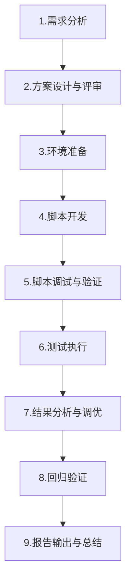

# 性能测试 完整学习大纲

---

## 一、性能测试概述

### 1.1 什么是性能测试

**性能测试是通过模拟多种正常、峰值及异常负载条件，对系统的各项性能指标进行测试和评估的过程。** 其目的是验证系统是否能够满足用户预期的性能需求，发现系统中存在的性能瓶颈，优化系统性能，并为系统扩容和架构规划提供依据。

*   **核心目标**：
    *   评估系统在特定负载下的响应时间、吞吐量和资源利用率
    *   验证系统是否满足 SLA（Service Level Agreement，服务等级协议）要求
    *   发现并定位性能瓶颈，为优化提供方向
    *   预测系统容量，为扩容规划提供数据支撑
    *   保障系统在高并发场景下的稳定性

### 1.2 性能测试的重要性

| 维度 | 如果忽视性能测试 | 做好性能测试 |
| :--- | :--- | :--- |
| **用户体验** | 页面加载慢、操作卡顿，用户流失 | 流畅的交互体验，提升用户留存 |
| **业务收入** | 高峰期系统崩溃，直接造成收入损失 | 保障业务高峰期的稳定运行 |
| **品牌声誉** | 频繁宕机，用户口碑下降 | 稳定可靠的产品形象 |
| **运维成本** | 盲目扩容，资源浪费严重 | 精准的容量规划，降低 IT 成本 |
| **开发效率** | 线上频繁出问题，救火式排查 | 问题提前暴露，降低修复成本 |

### 1.3 性能测试 vs 功能测试

| 对比维度 | 功能测试 | 性能测试 |
| :--- | :--- | :--- |
| **关注点** | 功能是否正确 | 系统有多快、多稳定 |
| **回答的问题** | "系统能做这件事吗？" | "系统能同时服务多少用户？" |
| **测试方式** | 单用户、单次操作 | 多用户、持续负载 |
| **验证目标** | 功能是否正确 | 性能是否达标 |
| **测试数据** | 少量代表性数据 | 大量/海量数据场景 |
| **环境要求** | 功能可用即可 | 独立且与生产接近的环境 |
| **典型工具** | Selenium、Postman | JMeter、Locust、Gatling |

---

## 二、性能测试核心指标体系

### 2.1 响应时间（Response Time）

| 指标 | 说明 | 计算方式 |
| :--- | :--- | :--- |
| **平均响应时间（Avg）** | 所有请求响应时间的算术平均值 | `sum(响应时间) / 请求总数` |
| **中位数（P50/Median）** | 50% 的请求响应时间不超过此值 | 排序后取中间值 |
| **P90 响应时间** | 90% 的请求响应时间不超过此值 | 排序后取第 90 百分位值 |
| **P95 响应时间** | 95% 的请求响应时间不超过此值 | 排序后取第 95 百分位值 |
| **P99 响应时间** | 99% 的请求响应时间不超过此值 | 排序后取第 99 百分位值 |
| **最大响应时间（Max）** | 所有请求中的最大响应时间 | `max(响应时间)` |
| **最小响应时间（Min）** | 所有请求中的最小响应时间 | `min(响应时间)` |

<details markdown="1">
<summary>为什么关注百分位响应时间而非平均值？</summary>

平均值的"欺骗性"：假设 100 个请求中，99 个请求耗时 100ms，1 个请求耗时 10s，平均值约为 199ms。这个"199ms"完全掩盖了那个耗时 10s 的请求的实际体验。P95/P99 能够更真实地反映"长尾请求"的用户体验。

**业内通用标准（Web 应用）：**
*   P50 < 200ms：优秀
*   P90 < 500ms：良好
*   P95 < 1s：可接受
*   P99 < 2s：基本可用
*   超过 3s：需要优化

</details>

### 2.2 吞吐量（Throughput）

| 指标 | 说明 | 单位 |
| :--- | :--- | :--- |
| **TPS（Transactions Per Second）** | 每秒处理的事务数 | 笔/秒 |
| **QPS（Queries Per Second）** | 每秒处理的查询/请求数 | 次/秒 |
| **RPS（Requests Per Second）** | 每秒处理的请求数 | 次/秒 |
| **HPS（Hits Per Second）** | 每秒的 HTTP 命中数 | 次/秒 |

> **注意**：TPS 和 QPS 的区别——一个事务可能包含多个请求（如"下单"事务包含登录、浏览、加购物车、支付等多个请求）。

### 2.3 并发用户数

| 概念 | 说明 |
| :--- | :--- |
| **注册用户数** | 系统中已注册的总用户数量 |
| **在线用户数** | 同时在线（有 Session）的用户数 |
| **并发用户数（狭义）** | 同一时刻与服务器进行交互的用户数 |
| **并发用户数（面向测试）** | 在测试中模拟的同时发送请求的虚拟用户数（线程数） |

> **关键认知**：在线用户 ≠ 并发用户。一个在线用户可能正在浏览页面、思考、填写表单，不会持续发送请求。通常并发用户数 = 在线用户数 × (实际请求频率 / 平均思考时间)。

<details markdown="1">
<summary>并发用户数估算方法</summary>

**公式一：基于 PV 估算**
```
并发用户数 ≈ PV（日页面浏览量） × 80%（集中在活跃时段） / (活跃小时数 × 3600 × 单个用户请求间隔秒数)
```
举例：日 PV 1000 万，80% 集中在 4 小时内，平均每 10 秒一个请求：
`并发用户数 ≈ 10,000,000 × 0.8 / (4 × 3600 / 10) ≈ 5556`

**公式二：基于在线用户数估算**
```
并发用户数 ≈ 在线用户数 × 5%~20%（取决于业务类型）
```
*   电商、社交、游戏：取 10%~20%
*   企业办公、OA 系统：取 5%~10%

</details>

### 2.4 资源利用率

| 资源 | 关键指标 | 告警阈值参考 |
| :--- | :--- | :--- |
| **CPU** | `%user`, `%system`, `%iowait`, `Load Average` | `%user` > 80% 需关注 |
| **内存** | 已用内存、可用内存、Swap 使用 | 可用内存 < 15% 需告警 |
| **磁盘 I/O** | IOPS、读写吞吐量、`%util` | `%util` > 80% 需关注 |
| **网络** | 带宽使用率、丢包率、连接数 | 带宽 > 80% 需扩容 |
| **应用层** | 线程池使用率、连接池使用率、GC 频率 | 线程池排队 > 0 需关注 |

### 2.5 其他关键指标

| 指标 | 说明 |
| :--- | :--- |
| **错误率** | 失败请求数 / 总请求数，一般要求 < 0.1% |
| **首次内容渲染时间（FCP）** | 用户看到第一个内容的时间 |
| **最大内容渲染时间（LCP）** | 最大可见内容元素渲染完成的时间 |
| **首字节时间（TTFB）** | 浏览器接收第一个字节的时间 |
| **可交互时间（TTI）** | 页面完全可交互的时间 |

---

## 三、性能测试类型详解

### 3.1 负载测试（Load Test）

*   **定义**：在**预期的正常负载**条件下，模拟真实用户行为，测试系统各项性能指标是否满足预设要求
*   **目的**：验证系统在目标负载下的性能表现，确保上线后的用户体验
*   **场景示例**：
    *   模拟 500 并发用户在 30 分钟内持续操作，验证平均响应时间 < 500ms，TPS > 1000
    *   模拟某电商活动日的预估流量，验证系统各项指标达标

```
# JMeter 负载测试关键配置示例（CLI 模式）
jmeter -n -t load_test.jmx \
  -Jthreads=500 \          # 500 并发线程
  -Jrampup=300 \           # 5 分钟内逐步加压
  -Jduration=1800 \        # 持续 30 分钟
  -l results/load_test.jtl \
  -e -o reports/load_test/
```

### 3.2 压力测试（Stress Test）

*   **定义**：**持续增加负载**，直到系统某些资源达到饱和甚至崩溃，找到系统的性能拐点和极限
*   **目的**：发现系统的最大承载能力，了解系统在极端场景下的表现和恢复能力
*   **常见步骤**：
    1.  从低负载开始逐步加压（如每秒增加 10 个并发用户）
    2.  监控响应时间、TPS、错误率的变化
    3.  找到**性能拐点**（响应时间急剧上升的点）
    4.  继续加压直到系统崩溃
    5.  记录**最大并发数**和**崩溃时的系统状态**


### 3.3 稳定性测试（Endurance / Soak Test）

*   **定义**：在**一定负载下长时间运行**（通常 8~72 小时），观察系统的长期稳定性表现
*   **目的**：发现内存泄漏、连接池耗尽、日志堆积、线程死锁等只有在长时间运行后才会暴露的问题
*   **关键观察点**：
    *   内存使用是否持续增长（内存泄漏的典型特征）
    *   响应时间是否随时间推移而恶化
    *   GC（垃圾回收）频率和时间是否异常
    *   数据库连接池、线程池是否正常回收

| 测试阶段 | 时长建议 | 监控重点 |
| :--- | :--- | :--- |
| 短期 | 2~4 小时 | 基本性能指标是否稳定 |
| 中期 | 8~12 小时 | 是否存在缓慢的内存泄漏 |
| 长期 | 24~72 小时 | GC 行为、线程死锁、磁盘空间增长 |

### 3.4 并发测试（Concurrency Test）

*   **定义**：模拟**多个用户同时执行同一操作**或**操作同一数据**，检查系统是否出现并发问题
*   **目的**：发现死锁、数据不一致、超卖、重复提交等并发问题
*   **典型场景**：
    *   多人同时抢购同一商品（库存扣减）
    *   多人同时注册同一用户名
    *   多人同时对同一数据进行编辑
    *   秒杀、限时抢购场景

### 3.5 容量测试（Capacity Test）

*   **定义**：在给定的性能指标要求下，确定系统能够支持的**最大用户数或数据量**
*   **目的**：为系统扩容、架构决策提供依据
*   **典型问题**：在当前架构下，系统最大能支持多少注册用户？单表数据达到 1 亿条时，查询性能能否接受？

### 3.6 基准测试（Benchmark Test）

*   **定义**：在**标准环境和固定条件**下，对系统（或某个模块/接口）进行性能测试，建立性能基准线
*   **目的**：
    *   记录系统初始性能状态，供后续对比
    *   版本迭代时快速发现性能退化
    *   CI/CD 流水线中的性能门禁

<details markdown="1">
<summary>性能测试类型对比总结</summary>

| 测试类型 | 核心问题 | 负载水平 | 持续时间 | 主要产出 |
| :--- | :--- | :--- | :--- | :--- |
| **负载测试** | 系统能否扛住预期负载？ | 预期正常负载 | 10~60 分钟 | 性能是否达标 |
| **压力测试** | 系统的极限在哪？ | 逐步增加到极限 | 逐级加压 | 最大承载能力 |
| **稳定性测试** | 长时间跑会出问题吗？ | 中等固定负载 | 8~72 小时 | 内存/连接泄漏 |
| **并发测试** | 多人同时操作会冲突吗？ | 高并发同一操作 | 5~30 分钟 | 并发安全问题 |
| **容量测试** | 系统能支撑多大体量？ | 逐步增加负载 | 按需 | 容量规划数据 |
| **基准测试** | 当前性能基线是多少？ | 固定标准负载 | 每次一致 | 性能基线数据 |

</details>

---

## 四、性能测试工具选型

### 4.1 主流工具对比

| 工具 | 语言 | 协议支持 | 分布式 | 优势 | 劣势 | 适用场景 |
| :--- | :--- | :--- | :--- | :--- | :--- | :--- |
| **JMeter** | Java | HTTP/HTTPS、JDBC、FTP、JMS、TCP 等 | 原生支持 | 生态成熟、GUI 操作、插件丰富 | 并发数受限于机器资源、资源消耗较大 | 企业级项目、多协议场景 |
| **Locust** | Python | HTTP/HTTPS（可扩展） | 原生支持 | 代码即测试、资源消耗低、实时 Web UI | 协议支持较少、需编程能力 | Python 技术栈团队 |
| **Gatling** | Scala | HTTP/HTTPS、JMS、JDBC | 原生支持 | 高性能（异步非阻塞）、报表精美 | 学习曲线较陡 | 高并发场景、对报表要求高 |
| **wrk / wrk2** | C/Lua | HTTP/HTTPS | 不支持 | 极高性能、资源消耗极低 | 不支持复杂场景、无 GUI | 接口级快速压测 |
| **k6** | Go/JavaScript | HTTP/HTTPS、WebSocket、gRPC | 原生支持 | 开发者友好、CI/CD 集成好 | 不支持分布式免费版 | 微服务、云原生 |
| **LoadRunner** | C/Java | 几乎所有协议 | 原生支持 | 协议支持最全面、企业级 | 商业收费、部署复杂 | 大型企业、传统 IT |

### 4.2 工具选型建议

```
小型项目 / 快速验证      → wrk, k6
Python 技术栈            → Locust
Java / 传统企业            → JMeter
高并发 / 优美报表         → Gatling
多协议 / 重量级企业       → LoadRunner
CI/CD 集成                → k6, Locust
```

---

## 五、性能测试流程与方法论

### 5.1 性能测试标准流程



### 5.2 各阶段详细说明

#### 阶段一：需求分析

*   **明确测试目标**：需要验证的指标及目标值（如：TPS > 2000，P95 < 500ms）
*   **梳理业务场景**：哪些是核心高频接口？哪些是复杂业务链路？
*   **确定用户模型**：日活、高峰时段、用户行为路径与占比
*   **定义风险标准**：SLA 指标及压测终止条件

| 业务场景 | 占比 | 目标 TPS | 目标 P95 |
| :--- | :---: | :---: | :---: |
| 首页加载 | 30% | 3000 | < 500ms |
| 商品搜索 | 25% | 2500 | < 800ms |
| 商品详情 | 20% | 2000 | < 500ms |
| 加入购物车 | 10% | 1000 | < 300ms |
| 下单支付 | 10% | 500 | < 1000ms |
| 其他 | 5% | - | - |

#### 阶段二：方案设计与评审

*   测试场景与数据准备策略
*   加压方式与负载模型设计（阶梯加压 / 脉冲加压 / 突发加压）
*   并发用户数及各场景占比分配
*   监控指标的选取与监控项配置
*   压测时间窗口与准入准出条件

#### 阶段三：环境准备

| 环境要点 | 要求 |
| :--- | :--- |
| **硬件配置** | 与生产环境相近或等比例缩小的配置 |
| **软件版本** | 与生产环境一致的应用版本和配置 |
| **数据量级** | 接近或等于生产数据量（可脱敏） |
| **网络环境** | 排除网络带宽瓶颈，确保施压机到目标服务器的网络通畅 |
| **监控工具** | 部署应用监控（APM）、系统监控、数据库监控 |
| **隔离性** | 独立环境，不受其他任务干扰 |

#### 阶段四：脚本开发

*   录制或编写测试脚本（HTTP 请求、参数化、关联、断言）
*   数据参数化：使用测试数据集（CSV 文件、数据库）驱动
*   思考时间的设置：模拟真实用户的操作间隔
*   检查点/断言：确保请求返回正确，而非只关注"请求发出去了"

#### 阶段五：测试执行

*   **基准测试**：先跑 1~5 个并发，验证脚本正确性与环境可用性
*   **预热**：让系统先运行一段时间，达到稳定状态后再采集数据
*   **阶梯加压**：逐步增加并发数，观察系统表现
*   **持续负载**：在目标负载水平下持续测试
*   **监控记录**：实时监控各项指标，达到终止条件立即停止

#### 阶段六：结果分析与调优

将采集到的数据与预期指标对比，分析不达标的指标对应的瓶颈点，进行性能调优。

#### 阶段七：回归验证

调优后重新执行测试，验证优化效果，确保没有引入新问题。

#### 阶段八：报告输出

撰写性能测试报告，包含：测试概述、环境信息、场景及结果数据、瓶颈分析、优化建议、结论。

---

## 六、性能瓶颈分析与定位

### 6.1 性能瓶颈分层分析模型

```
┌─────────────────────────────────────────┐
│            客户端层（前端/App）           │  ← 页面渲染慢、资源加载多、重复请求
├─────────────────────────────────────────┤
│             网络层（CDN/DNS/带宽）        │  ← 网络延迟、带宽瓶颈、DNS 解析慢
├─────────────────────────────────────────┤
│           网关/负载均衡层（Nginx 等）      │  ← 连接数上限、配置不当
├─────────────────────────────────────────┤
│              应用服务层（后端）           │  ← 线程池满、代码逻辑慢、GC 频繁
├─────────────────────────────────────────┤
│              缓存层（Redis 等）           │  ← 缓存命中率低、缓存穿透/雪崩
├─────────────────────────────────────────┤
│              数据库层（MySQL 等）         │  ← 慢 SQL、锁等待、连接数不足
├─────────────────────────────────────────┤
│            存储/中间件层（MQ/ES 等）      │  ← 消息积压、索引性能差
└─────────────────────────────────────────┘
```

### 6.2 自顶向下的排查思路

**第一步：从现象判断瓶颈类型**

| 现象 | 可能的方向 |
| :--- | :--- |
| TPS 先升后平（无法继续提升） | 达到资源瓶颈（线程池满、连接池满、CPU 打满） |
| 响应时间逐步上升 | 队列堆积、内存泄漏、GC 压力增大 |
| 错误率突然上升 | 超时、连接耗尽、服务降级熔断 |
| 周期性性能波动 | 定时任务干扰、GC 暂停、缓存失效 |

**第二步：分层排查**

1.  **应用层**：线程池状态、慢方法（Arthas / 火焰图）、GC 日志
2.  **数据库层**：慢查询日志、锁等待、连接数、命中率
3.  **缓存层**：命中率、内存使用率、慢查询
4.  **系统层**：CPU / 内存 / 磁盘 I/O / 网络（top, vmstat, iostat, netstat）

### 6.3 常见性能瓶颈及解决方案

<details markdown="1">
<summary>瓶颈 1：数据库慢查询</summary>

*   **现象**：TPS 不高，响应时间长，数据库 CPU 高
*   **排查方法**：
    ```sql
    -- MySQL 查看正在执行的慢查询
    SHOW FULL PROCESSLIST;
    -- 开启慢查询日志
    SET GLOBAL slow_query_log = 'ON';
    SET GLOBAL long_query_time = 1;  -- 超过 1s 的查询记录
    ```
*   **解决方向**：
    *   添加/优化索引（覆盖索引、联合索引）
    *   优化 SQL 语句（避免 `SELECT *`、避免全表扫描）
    *   读写分离（主库写、从库读）
    *   分库分表
    *   使用连接池（如 HikariCP）并合理配置

</details>

<details markdown="1">
<summary>瓶颈 2：缓存穿透/击穿/雪崩</summary>

| 问题 | 描述 | 解决方案 |
| :--- | :--- | :--- |
| **缓存穿透** | 查询不存在的数据，缓存和数据库都查不到 | 布隆过滤器、缓存空值 |
| **缓存击穿** | 热点数据过期瞬间，大量请求打到数据库 | 互斥锁、永不过期、逻辑过期 |
| **缓存雪崩** | 大量缓存同时过期 | 过期时间加随机值、多级缓存、限流降级 |

</details>

<details markdown="1">
<summary>瓶颈 3：线程池 / 连接池配置不当</summary>

```yaml
# 线程池核心参数
corePoolSize: 核心线程数（常驻线程）
maxPoolSize: 最大线程数
queueCapacity: 队列容量
rejectedExecutionHandler: 拒绝策略

# 关键原则：
# 1. 线程数并非越多越好，过多会导致频繁的上下文切换
# 2. CPU 密集型：线程数 ≈ CPU 核数 + 1
# 3. IO 密集型：线程数 ≈ CPU 核数 × 2（或更多，取决于 IO 等待时间）
# 4. 连接池的合理大小取决于数据库能承受的最大连接数
```

</details>

<details markdown="1">
<summary>瓶颈 4：JVM GC 频繁 / STW 过长</summary>

*   **现象**：周期性响应时间飙升，GC 日志中 Full GC 频繁
*   **排查**：`jstat -gcutil <pid> 1000` 查看 GC 情况，分析 GC 日志
*   **解决方向**：
    *   增大年轻代，减少对象晋升到老年代
    *   选择适合的 GC 收集器（G1、ZGC）
    *   优化代码，减少对象创建（避免频繁创建大对象、使用对象池）
    *   及时释放引用，避免内存泄漏

</details>

---

## 七、性能调优策略

### 7.1 调优总体原则

1.  **先优化业务逻辑，再优化技术实现**：去掉不必要的调用、合并重复查询
2.  **先数据库，再应用，后 JVM**：数据库通常是最大的瓶颈
3.  **缓存是银弹，但要慎用**：能缓存就缓存，但要处理好一致性
4.  **异步化**：非核心流程异步处理，降低主链路耗时
5.  **一次优化一个变量**：每次只改一个配置/一处代码，对比前后的效果
6.  **不要过早优化**：先搞清瓶颈在哪，再精准优化

### 7.2 常见优化策略速查

| 层级 | 策略 | 效果 |
| :--- | :--- | :--- |
| **前端** | CDN 加速、资源压缩合并、懒加载、减少 DOM 操作 | 减少首屏加载时间 |
| **网络** | 启用 HTTP/2、开启 Gzip、减少请求数 | 减少传输时间 |
| **网关** | Nginx 限流、熔断降级、静态资源分离 | 保护后端，提升吞吐 |
| **应用** | 异步处理、池化技术、并行调用、本地缓存 | 提升响应速度 |
| **缓存** | 多级缓存（本地 + 分布式）、热点数据预加载 | 大幅降低数据库压力 |
| **数据库** | 索引优化、SQL 优化、读写分离、分库分表 | 提升查询效率 |
| **消息队列** | 削峰填谷、异步解耦 | 平滑流量峰值 |

### 7.3 性能调优的反模式

*   ❌ 上来就加机器（没有定位瓶颈，加机器可能无效）
*   ❌ 盲目加缓存（缓存能掩盖问题但不能根本解决）
*   ❌ 到处加日志（日志本身也消耗性能）
*   ❌ 只优化单接口不看全局（可能引入新的瓶颈）
*   ❌ 压测环境与生产差异巨大（优化结论不可信）

---

## 八、性能测试报告

### 8.1 报告核心要素

一份完整的性能测试报告应包含以下内容：

| 章节 | 内容 |
| :--- | :--- |
| **1. 测试概述** | 测试目的、测试范围、测试时间 |
| **2. 测试环境** | 服务器配置、网络拓扑、软件版本、数据量 |
| **3. 测试工具与方案** | 使用的工具、场景设计、负载模型、加压策略 |
| **4. 测试场景与结果** | 各场景的 TPS、响应时间、并发数、错误率等数据 |
| **5. 资源监控数据** | CPU、内存、磁盘 I/O、网络等系统资源使用情况 |
| **6. 瓶颈分析** | 发现的瓶颈点、根因分析 |
| **7. 优化建议** | 短期/中期/长期的优化方案 |
| **8. 结论** | 系统性能是否达标、是否建议上线 |

### 8.2 报告数据可视化要点

*   **TPS vs 并发数曲线图**：展示吞吐量随并发数的变化
*   **响应时间 vs 并发数曲线图**：展示响应时间的变化趋势
*   **响应时间百分位分布图**：P50/P90/P95/P99 的对比
*   **资源利用率折线图**：CPU、内存随时间的变化
*   **错误率变化图**：错误率随负载的变化

---

## 九、模拟面试题

**题目 1：基础概念**：请简述一下负载测试、压力测试、稳定性测试的区别。

> **参考回答**：三者核心区别在于目的和负载水平。**负载测试**是在预期正常负载下验证系统性能指标是否达标；**压力测试**是逐步加压找到系统的性能拐点和最大承载能力；**稳定性测试**是在一定负载下长时间运行（如 24 小时），观察是否存在内存泄漏、连接池耗尽等长期运行才会暴露的问题。简单来说：负载测试问"能不能扛住"，压力测试问"极限在哪"，稳定性测试问"长时间跑会不会出问题"。

**题目 2：指标理解**：为什么性能测试中要关注 P95、P99 而不是只看平均响应时间？

> **参考回答**：平均值容易受到极端值的影响，会掩盖"长尾"问题。比如 100 个请求中 99 个响应用时 100ms，但有 1 个用了 10 秒，平均值约 199ms，看起来不错，但那 1 个用户的实际体验极差。P95/P99 关注最差的那 5% 或 1% 的用户体验，更能反映真实的服务质量。尤其对于电商、金融等场景，"长尾用户"的体验直接关系到转化率和满意度。

**题目 3：场景设计**：一个电商系统，日活用户 50 万，峰值时段 20:00-22:00 占全天 60% 流量，请估算并发用户数，并设计混合场景。

> **参考回答**：
> **并发数估算**：峰值 QPS = (50 万 × 60%) × 人均请求数（假设 30 个） / (2 小时 × 3600 秒) ≈ 1250 QPS。假设每个请求处理耗时 0.5s，并发数 ≈ 1250 × 0.5 = 625。考虑 1.5 倍安全系数，建议按 1000 并发设计。
> **混合场景设计**：按核心链路分配——首页浏览 30%（300 并发）、商品搜索 20%（200 并发）、商品详情 20%（200 并发）、加购下单 20%（200 并发）、个人中心 10%（100 并发）。

**题目 4：排查思路**：性能测试中发现 TPS 达到 500 后就再也上不去了，如何排查？

> **参考回答**：这是一个典型的"吞吐量瓶颈"问题，排查思路如下：
> 1. **确认是否是施压机的瓶颈**：检查施压机 CPU/内存是否打满、网络带宽是否占满
> 2. **检查应用层**：查看线程池/连接池是否已满（如 Tomcat 线程数达到 maxThreads）、GC 是否频繁
> 3. **检查数据库层**：慢查询日志、数据库连接数是否耗尽、是否存在锁等待
> 4. **检查中间件**：Redis 连接数、MQ 消费速度
> 5. **使用 profiling 工具**（如 Arthas、JProfiler）定位热点方法
> 6. 逐一排除，定位到具体瓶颈后进行针对性优化

**题目 5：综合题**：你如何从 0 到 1 搭建一个项目的性能测试体系？

> **参考回答**：
> 1. **基准建立**：先对核心单接口做基准测试，记录初始性能基线
> 2. **工具选型**：根据技术栈选择合适的工具（Java 项目用 JMeter/Gatling，Python 项目用 Locust）
> 3. **场景设计**：与产品和开发确认核心业务链路、用户模型和 SLA 指标
> 4. **环境搭建**：搭建独立的压测环境，部署监控（应用监控 + 系统监控）
> 5. **脚本开发与验证**：编写压测脚本，基准测试验证正确性
> 6. **执行与调优**：执行压测 → 分析瓶颈 → 推动优化 → 回归验证
> 7. **持续集成**：将核心接口的性能基准测试纳入 CI/CD 流水线，每次发版自动对比基线
> 8. **常态化压测**：定期（如每月）执行全链路压测，建立性能趋势看板

---

## 十、总结

*   **性能测试不是跑一遍就完事**，它是一个持续迭代的过程，需要建立基线、持续监控、定期回归
*   **指标体系是核心**：响应时间、吞吐量、并发数、错误率、资源利用率五大指标缺一不可
*   **不要忘记百分位**：P95/P99 比平均值更能反映真实用户体验
*   **定位优于猜测**：遇到瓶颈不要凭感觉优化，要基于监控数据和 profiling 定位根因
*   **性能前置**：在架构设计阶段就考虑性能，而非上线前才开始"压测"
*   **工具选对**：根据团队技术栈和项目规模选择合适的工具，不要过度追求"最强工具"
*   **性能测试的左移**：将性能基准测试集成到 CI/CD 中，实现每次提交的性能回归
*   **生产验证不可或缺**：在有监控和保障的前提下，定期进行生产环境的压测
